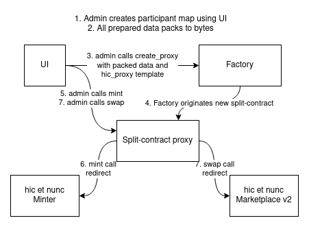

# Split-sales proxy contacts for collaboration

This is experimental smart contract **factory** that allows to create **split-contracts**. Split-contracts can be used as a proxy to another contracts replacing `tz` address with `KT`, so this is kind of admin-managed entity. This enables onchain distribution for all incoming xtz. The project received support durring hicathon and this contracts was used to demonstrate various collaborative concepts within hic et nunc ecosystem.

--------------------------------------------------------------------------------
NOTE: This contracts are not audited and they may have undetected vulnerabilities. This is just proof of concept. Use it for own risk and fun.
--------------------------------------------------------------------------------

## How it works?

### Factory and new split-contract creation
Smart contract factory deployed in the mainnet: [`KT1..KP1N`](https://better-call.dev/mainnet/KT1DoyD6kr8yLK8mRBFusyKYJUk2ZxNHKP1N/operations). To create new collab, anyone can call `create_proxy` with two params:
* `templateName`: string with template lambda used to originate new contract (`hic_proxy`)
* `params`: bytes with data that unpacked inside selected template lambda. For `hic_proxy` template this is `participantsMap` that contains info about participant shares and roles

You can find example of split-contract origination in mainnet using this op hash: [`oovy..G2PX`](https://better-call.dev/mainnet/opg/oovy63fP6XmzDvMy5LnaeKPzhe81ur8oTNDQQW7kspepiU2G2PX/contents)

### Templates and records
Factory allow admin to add different proxy-contract templates using `add_template` entrypoint. There was template that was added during factory deploy: [`hic_proxy`](https://better-call.dev/mainnet/opg/ontPJgVMWCmQ1VbWSsEKs35uQNAFFRnXKBmjxXDDYu4ByDTPMaQ/contents). This template allows to create contracts that can mint and swap in h=n ecosystem. It is possible to add more templates with different functionality. It is possible to [update this template](https://better-call.dev/mainnet/opg/oofYy6YoDWbSNkwTTX85ZqzwwuA8aeQ8QF5uN6gd5QRNE8isEvf/contents) that will change the code of all newly created collab contracts.

Special entrypoint `add_record` allows factory admin to add / rewrite some packed data with values that used for contract creation. Currently this used to manage ecosystem addresses that are added to the split-contracts storage during origination: minter address, FA2 token address, marketplace address, and registry address.

### Factory deploy process
1. Originating factory contract with empty storage (only admin should be specified)
2. Adding `hic_proxy` template for h=n
3. Adding all required records using `add_record`

TODO: there should be pytezos script with all this deploy process
Example with configuration batch call: [`ontP..PMaQ`](https://better-call.dev/mainnet/opg/ontPJgVMWCmQ1VbWSsEKs35uQNAFFRnXKBmjxXDDYu4ByDTPMaQ/contents)

There is more details about Factory described [here](docs/factory_reference.md)

### HicProxy: the first split-contract implementation
HicProxy is the first example of the split-contract proxy that allows to communicate with h=n ecosystem (mint, swap v2, registry, transfer tokens). It consists of two parts: [the contract](contracts/main/HicProxy.ligo) and lambda function used to originate this contract, [the template](contracts/lambdas/originate/hicProxy.ligo).

HicProxy entrypoints described in [separate reference doc](docs/hic_proxy_reference.md).

Admin can not change shares distribution after contract creation. Admin can mint new objkts from the contract name and swap them. Admin have rights to run any operation from the contract name.

### Sign: UI shield
While working in wg3.2 during hicathon we found that there is potential vulnerability in UI that supports this split-contracts. The one can exploit UI by creating fake collaborations with famous artists. There is nothing bad to split your revenues with another artists without asking their permission to do this (at least this is impossible to stop). However, UI implementation supposed to show collaborations on the participant pages as special tab, so the one can exploit this to promote his works.

In order to solve this issue **sign** contract added. This is fully independent contract that allows anyone to claim that he is one of the core participants of some objkt created using h=n. There are no checks that the one who claiming this actually participated in the collab (and there are no checks that signed objkt exist at all), so anyone can claim that he is participant of any objkt. However this is useful to verify objkts that was created under collabs and UI required to all core participants sign that they agreed to be shown as a core participant of the given objkt.

As far as this information used only in UI and in combination with split-contract storage info, this is not a problem. In the future storage views can be implemented in Tezos which would simplify this onchain check process.

### SwapAdmin
This is experimental smart contract that can be used as an admin replacement that allows everyone to swap their tokens from the split-contract name. This can be used in charity events when split-contract redistributes all incoming xtz to the given benefactor addresses and acts as a Gallery or Collection. Anyone can put their tokens for a given price to be sold from this Gallery. Royalties would go to the original artist and exceeded sale amount whould be distributed between Gallery benefactors.

Example of this SwapAdmin in the mainnet: [`KT1..fYdP`](https://better-call.dev/mainnet/KT1C3xC8gcHzVLn3BJvAdjHRwY9PKiinfYdP/operations). You can go and swap whatever you want [using BCD](https://better-call.dev/mainnet/KT1C3xC8gcHzVLn3BJvAdjHRwY9PKiinfYdP/interact?entrypoint=swap)

Example of the Gallery with swapped token: [SwapAdmin test](https://www.hicetnunc.xyz/objkt/297301)

## Technologies
All contracts written in [PascaLIGO](https://ligolang.org/) v0.24. Docker image used to compile this contracts. There are some tests written using pytezos in pytezos\_tests directory. To run tests it is required to install [pytezos](https://pytezos.org/quick_start.html#installation), pytest and run `pytest -v` command.

You can have a look at the compilation+test script: [compile\_and\_test](compile_and_test.sh). Yep, this is not the highest standards devops but I found this way to be simple and powerfull enough to use. Also there `package.json` and other node.js truffle operations that can be used as alternative way to compile and deploy contracts but I found this process not very transparent and they will be removed in the future.

## Unlocked use cases for this split-contracts
- collaboration (multiple artists making one piece: all core participants)
- remix/derivative works (remixer as core participant and original artist as benefactor)
- artist management (artist as core participant + manager benefactor as admin)
- benefactors gallery and charity events (benefactors only without core participants)
- artist supporting open source (artist as core + benefactor)
- you can suggest more?

## Next tasks:
- looks like the thing that blocks UI from merge is indexer issues, so we need to run our own dipdup indexer that would be indexing split-contracts events

## Next mad ideas:
- contract with dynamic shares (extra-mad if this shares would be FA2 token)
- extra logic in `default` entrypoint
    * broker collaborator: buying hDAO from QuipuSwap and providing liquidity back to the hDAO/xtz pair
    * mint/distribute FA2 tokens on the primary sales (for everyone who buys from Gallery split-contract, for example). This may be possible if check transaction Sender is h=n marketplace
    * whitelisted gallery that allow to buy only for given list of allowed addresses (that either added during origination, either with some token staking logic)
    * FA2 token redistribution
    * Also this factory can be used to create this split-contracts for another cases, for example dividends split can be implemented or some split payments (we used this split-contract in wg3.2 to receive hicathon rewards)

## UI
Here you can find forked hicetnunc frontend, that allows you to pick proxy contract by it address and mint/swap objects using it: https://github.com/ztepler/hicetnunc

Big thanks to codewithfeeling who lead all this fork-end work and make this UI possible.

